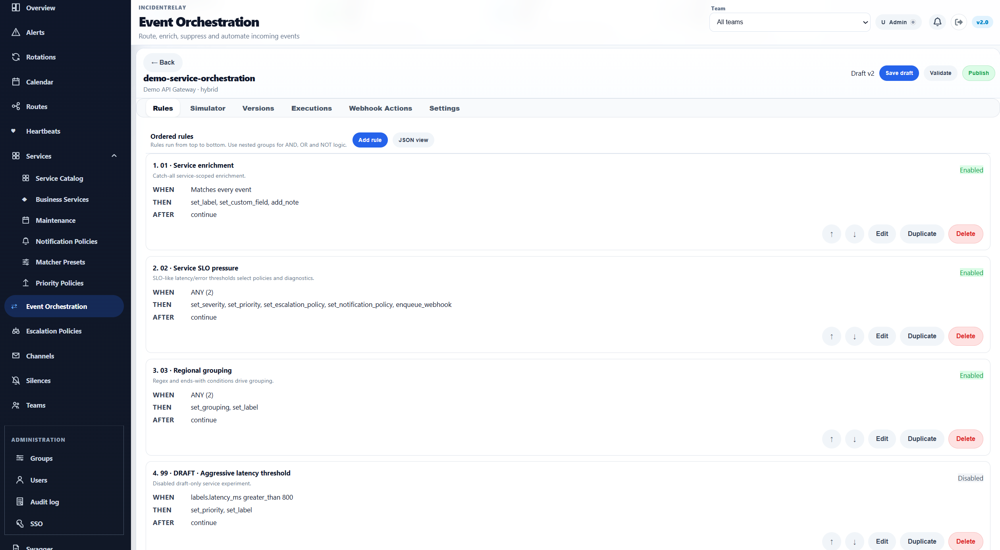
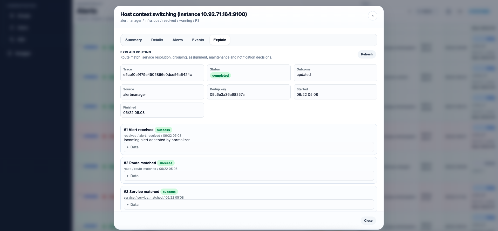

# IncidentRelay

**Self-hosted on-call, alert routing, event orchestration and incident response for teams that want to keep operational control in their own infrastructure.**

IncidentRelay receives alerts from monitoring systems, normalizes and orchestrates them, routes them to the responsible service and team, groups related signals into incidents, applies priority and escalation rules, and delivers notifications to on-call responders.

It is designed for SRE, DevOps, platform, infrastructure and operations teams that need PagerDuty-style building blocks without depending on a hosted incident-management platform.


## What IncidentRelay provides

### Alert intake, routing and orchestration

- route-based intake tokens and source-specific webhook endpoints;
- native integrations for Alertmanager, AWS SNS / CloudWatch, Azure Monitor, Datadog, Grafana, LibreNMS, Nagios, New Relic, RMON, Sentry, Uptime Kuma and Zabbix;
- generic webhook intake with PagerDuty Events API v2-compatible trigger, acknowledge and resolve events;
- Global and Service Event Orchestration;
- orchestration Builder and JSON editor, validation, simulation, shadow mode, replay, immutable published versions and rollback;
- orchestration actions for routing, service selection, labels, severity, priority, grouping, suppression, pause/drop decisions, policy selection and asynchronous webhooks;
- configurable Explain Trace detail and retention.

### Incident management

- alert groups with child alerts, deduplication and grouping;
- acknowledge and resolve workflows;
- incident priorities and priority policies;
- responders, stakeholders and comments;
- reminders and escalation policies;
- silences and maintenance windows;
- notification center and audit history;
- dependency-aware alert correlation and Explain Trace.

### Service catalog and impact

- technical services with ownership, criticality, tier, links and runbooks;
- matcher-based service routing and reusable matcher presets;
- service dependencies and blast-radius analysis;
- Business Services and component impact;
- current service impact plus historical impact snapshots;
- Service Standards and readiness checks;
- SLI/SLO definitions and measurements;
- service events and default stakeholders;
- Heartbeats with expected and auto-discovered instances.

### On-call and notification delivery

- groups, teams and RBAC-style group/team roles;
- rotations, rotation layers, restrictions and temporary overrides;
- on-call calendar, ICS feeds and CalDAV access;
- route channels and service Notification Policies;
- Mattermost, Slack, Telegram, Discord, Microsoft Teams, email and generic webhook delivery;
- interactive ACK / Resolve actions for supported chat providers;
- profile-level browser/PWA push notifications;
- personal notification rules for browser push, email and voice-call follow-up;
- pluggable self-hosted voice providers.

### Access and administration

- OIDC and SAML 2.0 SSO with mapping rules;
- personal API tokens with scopes;
- Swagger/OpenAPI documentation;
- configurable retention for resolved alerts and diagnostic/orchestration history;
- SQLite for small single-node installations and PostgreSQL for larger deployments;
- Docker Compose, Helm/Kubernetes, RPM and manual systemd installation paths.

---

## Alert flow

A simplified IncidentRelay 2.x flow looks like this:

```text
Monitoring system
      ↓
Integration authentication + normalization
      ↓
Global Event Orchestration
      ↓
Route / Service / Team selection
      ↓
Service Event Orchestration
      ↓
Grouping + correlation + priority
      ↓
Rotation / escalation + notification policy
      ↓
Shared channels + personal notification rules
      ↓
ACK / Resolve / responders / stakeholders
```

Routes control how alerts enter IncidentRelay and provide the security boundary for intake tokens. Services describe **what** is affected. Notification delivery can come directly from route channels, from a service Notification Policy, or from both, depending on route configuration. Event Orchestration can override routing, service and policy decisions for matching events.

Browser/PWA push and personal notification rules are evaluated separately from shared route/service channels.

---

## Event Orchestration

Event Orchestration lets incoming events be transformed and routed before the normal alert lifecycle finishes processing them.

Typical rules can:

```text
IF labels.environment == production
AND severity == critical
THEN
  select Payments service
  set priority P1
  use Critical escalation policy
  normalize labels
```

Global orchestration can make group-wide routing decisions. Service orchestration runs after a service is known and can apply service-specific logic. Published definitions support simulation, shadow evaluation, replay, version history and rollback.



Explain Trace shows why an alert was routed, grouped, prioritized, suppressed or notified the way it was.



Read more: [Event Orchestration](docs/usage/event-orchestration.md) and [Explain Trace](docs/incidents/explain-trace.md).

---

## Supported integrations

### Incoming alert sources

| Source | Endpoint | Documentation |
|---|---|---|
| Alertmanager | `POST /api/integrations/alertmanager` | [Alertmanager](docs/integrations/alertmanager.md) |
| AWS SNS / CloudWatch | `POST /api/integrations/aws-sns/<route_id>` | [AWS SNS / CloudWatch](docs/integrations/aws-sns-cloudwatch.md) |
| Azure Monitor | `POST /api/integrations/azure-monitor` | [Azure Monitor](docs/integrations/azure-monitor.md) |
| Datadog | `POST /api/integrations/datadog` | [Datadog](docs/integrations/datadog.md) |
| Grafana | `POST /api/integrations/grafana` | [Grafana](docs/integrations/grafana.md) |
| LibreNMS | `POST /api/integrations/librenms` | [LibreNMS](docs/integrations/librenms.md) |
| Nagios | `POST /api/integrations/nagios` | [Nagios](docs/integrations/nagios.md) |
| New Relic | `POST /api/integrations/new-relic` | [New Relic](docs/integrations/new-relic.md) |
| RMON | `POST /api/integrations/rmon` | [RMON](docs/integrations/rmon.md) |
| Sentry | `POST /api/integrations/sentry/<route_id>` | [Sentry](docs/integrations/sentry.md) |
| Uptime Kuma | `POST /api/integrations/uptime-kuma` | [Uptime Kuma](docs/integrations/uptime-kuma.md) |
| Zabbix | `POST /api/integrations/zabbix` | [Zabbix](docs/integrations/zabbix.md) |
| Generic / PagerDuty Events API v2 | `POST /api/integrations/webhook` | [Generic webhook](docs/integrations/generic-webhook.md) |

Incoming integrations use route intake credentials. The generated endpoint/help text on the Routes page shows the authentication form supported by each source.

### Shared notification channels

| Channel | Notes |
|---|---|
| Mattermost | Incoming webhook or Bot API; Bot API supports interactive actions and message updates |
| Slack | Incoming webhook or Bot API; interactive actions can use HTTP callbacks or Socket Mode worker |
| Telegram | Bot notifications with optional action buttons |
| Discord | Webhook delivery |
| Microsoft Teams | Webhook delivery |
| Email | Delivered through global SMTP configuration |
| Webhook | Generic outbound webhook |

Browser/PWA push is profile-level rather than a shared channel. Personal notification rules can deliver through browser push, email or voice call to the assigned user's profile contacts.

Read more: [Notification channels](docs/integrations/channels.md) and [Notification Policies](docs/services/notification-policies.md).

---

## Installation

### Docker Compose

Docker Compose is the fastest way to run a small self-hosted installation. The repository Compose file uses the published IncidentRelay image and starts the web service, scheduler, Telegram worker and Slack Socket Mode worker.

```bash
cd docker
docker compose up -d
```

Open:

```text
http://SERVER_IP:8080/login
```

Use PostgreSQL with the supplied override:

```bash
docker compose \
  -f docker-compose.yml \
  -f docker-compose.postgres.yml \
  up -d
```

Read more: [Docker installation](docs/getting-started/docker.md).

### Kubernetes / Helm

The Helm chart is published as an OCI artifact in GHCR:

```bash
helm install incidentrelay \
  oci://ghcr.io/roxy-wi/incidentrelay-charts/incidentrelay \
  --version 2.2.0 \
  --set-string config.main.secret_key="$(openssl rand -hex 32)"
```

The chart defaults to the `ghcr.io/roxy-wi/incidentrelay:2.2` application image. Configuration can be rendered from `config.*` values or supplied through `existingConfigSecret`.

Read more: [Kubernetes installation](docs/getting-started/kubernetes.md).

### RHEL / Rocky Linux / AlmaLinux / CentOS Stream

```bash
sudo dnf install -y curl
sudo curl -fsSL \
  https://repo.incidentrelay.io/incidentrelay.repo \
  -o /etc/yum.repos.d/incidentrelay.repo
sudo dnf makecache
sudo dnf install -y incidentrelay
```

Read more: [RPM installation](docs/getting-started/rpm-installation.md).

### Manual systemd installation

Use the manual installation path when running directly from a source checkout or when you manage the Python environment yourself.

Read more: [Systemd installation](docs/getting-started/systemd.md).

---

## Runtime services

A full installation can run these processes:

```text
incidentrelay.service                  # HTTP API, UI and incoming webhooks
incidentrelay-scheduler.service        # reminders, escalations and periodic jobs
incidentrelay-telegram-worker.service  # optional Telegram callbacks / polling
incidentrelay-slack-worker.service     # optional Slack Socket Mode interactions
```

The scheduler should run as a dedicated process rather than once per web worker.

Common RPM/systemd paths:

```text
/var/www/incidentrelay
/var/www/incidentrelay/venv
/etc/incidentrelay/incidentrelay.conf
/var/lib/incidentrelay
/var/log/incidentrelay
/usr/local/lib/incidentrelay/voice_providers
```

---

## Configuration

IncidentRelay reads the configuration file path from:

```text
INCIDENTRELAY_CONFIG_FILE
```

Example:

```bash
export INCIDENTRELAY_CONFIG_FILE=/etc/incidentrelay/incidentrelay.conf
```

For production, set the public base URL used for links and provider callbacks:

```ini
[server]
public_base_url = https://incidentrelay.example.com
```

SQLite is suitable for a small single-node installation:

```ini
[database]
type = sqlite
name = /var/lib/incidentrelay/incidentrelay.db

[sqlite]
wal = true
busy_timeout = 5000
```

PostgreSQL is recommended for larger installations and multi-worker deployments:

```ini
[database]
type = postgresql
host = 127.0.0.1
port = 5432
name = incidentrelay
user = incidentrelay
password = change-me
```

Important operational settings include retention, outbound HTTP network policy and Explain Trace detail. See [Configuration](docs/getting-started/configuration.md) for the canonical reference.

---

## First setup

For RPM/systemd installations, run migrations and create the first administrator:

```bash
sudo -u incidentrelay \
  INCIDENTRELAY_CONFIG_FILE=/etc/incidentrelay/incidentrelay.conf \
  /var/www/incidentrelay/venv/bin/python \
  /var/www/incidentrelay/manage.py migrate
```

```bash
sudo -u incidentrelay \
  INCIDENTRELAY_CONFIG_FILE=/etc/incidentrelay/incidentrelay.conf \
  /var/www/incidentrelay/venv/bin/python \
  /var/www/incidentrelay/manage.py create-admin \
  --username admin \
  --password 'change-me-123' \
  --email admin@example.com
```

For Docker Compose, the web container can run migrations automatically. Create the first administrator with:

```bash
cd docker
docker compose exec incidentrelay \
  python manage.py create-admin \
  --username admin \
  --password 'change-me-123' \
  --email admin@example.com
```

Change the example password before production use.

A typical UI setup is:

```text
1. Create a group and users
2. Create a team and assign team roles
3. Create a rotation and on-call members
4. Create technical services
5. Add runbooks, links and dependencies as needed
6. Create shared notification channels
7. Optionally create notification / priority / escalation policies
8. Create a route and select its service/channel mode
9. Optionally configure Global or Service Event Orchestration
10. Copy the route intake credential into the monitoring system
11. Send a test alert and verify ACK / Resolve
```

Detailed guide: [First login and initial setup](docs/getting-started/first-login.md).

---

## Example Alertmanager request

```bash
curl -X POST http://127.0.0.1:8080/api/integrations/alertmanager \
  -H 'Content-Type: application/json' \
  -H 'Authorization: Bearer ROUTE_TOKEN' \
  -d '{
    "status": "firing",
    "alerts": [
      {
        "status": "firing",
        "labels": {
          "alertname": "DiskFull",
          "severity": "critical",
          "team": "infra",
          "instance": "host1"
        },
        "annotations": {
          "summary": "Disk is full",
          "description": "/var is 95% full"
        },
        "fingerprint": "disk-full-host1-var"
      }
    ]
  }'
```

Read more: [Alertmanager integration](docs/integrations/alertmanager.md).

---

## API

Swagger UI:

```text
/docs
```

OpenAPI JSON:

```text
/api/openapi.json
```

Personal API tokens can be created from the user profile and restricted by scope.

Read more: [API documentation](docs/api/index.md) and [Profile/API tokens](docs/usage/profile-and-tokens.md).

---

## Documentation

| Area | Documentation |
|---|---|
| Getting started | [Getting started](docs/getting-started/index.md) |
| Configuration | [Configuration](docs/getting-started/configuration.md) |
| Groups and RBAC | [Groups and RBAC](docs/concepts/groups-and-rbac.md) |
| Teams, rotations and routes | [Teams, rotations and routes](docs/concepts/teams-rotations-routes.md) |
| Alerts and incidents | [Alerts](docs/usage/alerts.md) |
| Event Orchestration | [Event Orchestration](docs/usage/event-orchestration.md) |
| Explain Trace | [Explain Trace](docs/incidents/explain-trace.md) |
| Incident priorities | [Priorities](docs/incidents/priorities.md) |
| Responders / stakeholders | [Responders](docs/incidents/responders.md) / [Stakeholders](docs/incidents/stakeholders.md) |
| Services | [Services](docs/concepts/services.md) |
| Business Services | [Business Services](docs/concepts/business-services.md) |
| Dependency correlation | [Alert correlation](docs/concepts/alert-correlation.md) |
| Service SLI/SLO | [SLI/SLO](docs/services/service-sli-slo.md) |
| Service standards | [Standards and events](docs/services/service-standards-and-events.md) |
| Heartbeats | [Heartbeats](docs/concepts/heartbeats.md) |
| Notification Policies | [Notification Policies](docs/services/notification-policies.md) |
| Maintenance windows | [Maintenance Windows](docs/concepts/maintenance-windows.md) |
| On-call calendar | [Calendar](docs/usage/calendar.md) |
| Browser/PWA push | [Browser Push](docs/usage/browser-push.md) |
| SSO | [OIDC and SAML](docs/administration/sso.md) |
| Data retention | [Data retention](docs/administration/data-retention.md) |
| Integrations | [Integrations](docs/integrations/index.md) |
| Troubleshooting | [Troubleshooting](docs/administration/troubleshooting.md) |

---

## Demo and development checks

Create demo data:

```bash
python manage.py demo-data
```

After migrations, verify that the configured database matches the Peewee models:

```bash
python app/check_schema.py
```

See [Demo data](docs/administration/demo-data.md), [Schema check](docs/administration/schema-check.md) and [CONTRIBUTING.md](CONTRIBUTING.md).

---

## License

IncidentRelay is licensed under the [MIT License](LICENSE).
